# [📈 Live Status](https://status.codeforafrica.org): <!--live status--> **🟧 Partial outage**

This repository contains the open-source uptime monitor and status page for [Code for Africa (CfA)](https://codeforafrica.org), powered by [Upptime](https://github.com/upptime/upptime).

With [Upptime](https://upptime.js.org), you can get your own unlimited and free uptime monitor and status page, powered entirely by a GitHub repository. We use [Issues](https://github.com/CodeForAfrica/upptime/issues) as incident reports, [Actions](https://github.com/CodeForAfrica/upptime/actions) as uptime monitors, and [Pages](https://status.codeforafrica.org) for the status page.

<!--start: status pages-->
<!-- This summary is generated by Upptime (https://github.com/upptime/upptime) -->
<!-- Do not edit this manually, your changes will be overwritten -->
<!-- prettier-ignore -->
| URL | Status | History | Response Time | Uptime |
| --- | ------ | ------- | ------------- | ------ |
|  [academy.AFRICA](https://academy.africa/) | 🟩 Up | [academy-africa.yml](https://github.com/CodeForAfrica/upptime/commits/HEAD/history/academy-africa.yml) | 

 1457ms
     
 | 

<a href="https://status.codeforafrica.org/history/academy-africa">99.69%</a>
    

|  [AlertME - Kenya](https://greenalert.codeforkenya.org) | 🟩 Up | [alert-me-kenya.yml](https://github.com/CodeForAfrica/upptime/commits/HEAD/history/alert-me-kenya.yml) | 

 858ms
     
 | 

<a href="https://status.codeforafrica.org/history/alert-me-kenya">100.00%</a>
    

|  [AlertME - Nigeria](https://yamayama.codefornigeria.org) | 🟩 Up | [alert-me-nigeria.yml](https://github.com/CodeForAfrica/upptime/commits/HEAD/history/alert-me-nigeria.yml) | 

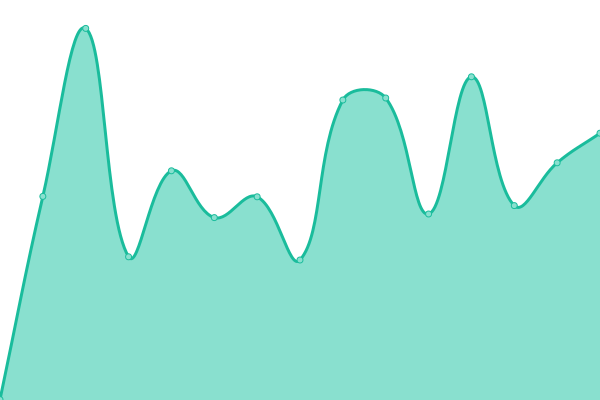 748ms
     
 | 

<a href="https://status.codeforafrica.org/history/alert-me-nigeria">100.00%</a>
    

|  [AlertME - South Africa](https://greenalert.oxpeckers.org) | 🟩 Up | [alert-me-south-africa.yml](https://github.com/CodeForAfrica/upptime/commits/HEAD/history/alert-me-south-africa.yml) | 

 815ms
     
 | 

<a href="https://status.codeforafrica.org/history/alert-me-south-africa">100.00%</a>
    

|  [CivicPatterns](https://civicpatterns.github.io) | 🟩 Up | [civic-patterns.yml](https://github.com/CodeForAfrica/upptime/commits/HEAD/history/civic-patterns.yml) | 

 186ms
     
 | 

<a href="https://status.codeforafrica.org/history/civic-patterns">100.00%</a>
    

|  [CivicSignal](https://civicsignal.africa) | 🟩 Up | [civic-signal.yml](https://github.com/CodeForAfrica/upptime/commits/HEAD/history/civic-signal.yml) | 

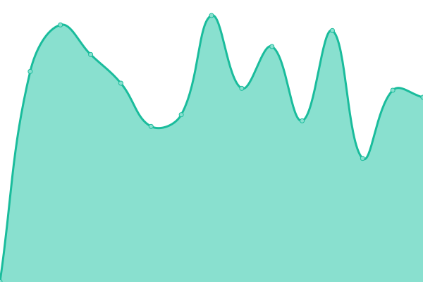 420ms
     
 | 

<a href="https://status.codeforafrica.org/history/civic-signal">100.00%</a>
    

|  [CivicSignal - Explorer](https://explorer.civicsignal.africa) | 🟩 Up | [civic-signal-explorer.yml](https://github.com/CodeForAfrica/upptime/commits/HEAD/history/civic-signal-explorer.yml) | 

 808ms
     
 | 

<a href="https://status.codeforafrica.org/history/civic-signal-explorer">100.00%</a>
    

|  [CivicSignal - Research](https://research.civicsignal.africa/) | 🟩 Up | [civic-signal-research.yml](https://github.com/CodeForAfrica/upptime/commits/HEAD/history/civic-signal-research.yml) | 

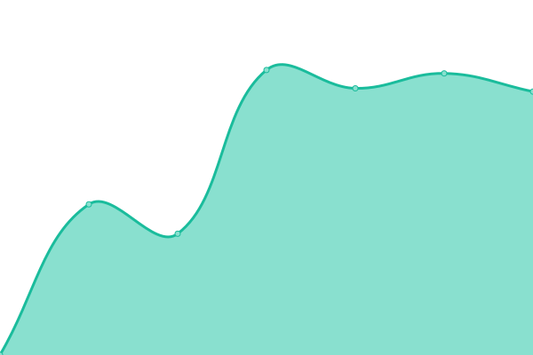 1391ms
     
 | 

<a href="https://status.codeforafrica.org/history/civic-signal-research">99.41%</a>
    

|  [CivicSignal - Sources](https://sources.civicsignal.africa) | 🟩 Up | [civic-signal-sources.yml](https://github.com/CodeForAfrica/upptime/commits/HEAD/history/civic-signal-sources.yml) | 

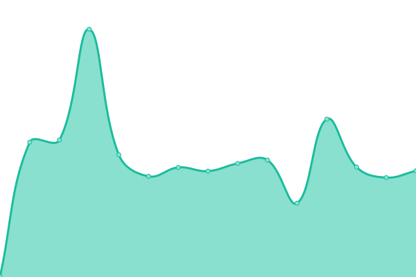 440ms
     
 | 

<a href="https://status.codeforafrica.org/history/civic-signal-sources">100.00%</a>
    

|  [CivicSignal - Topics](https://topics.civicsignal.africa) | 🟩 Up | [civic-signal-topics.yml](https://github.com/CodeForAfrica/upptime/commits/HEAD/history/civic-signal-topics.yml) | 

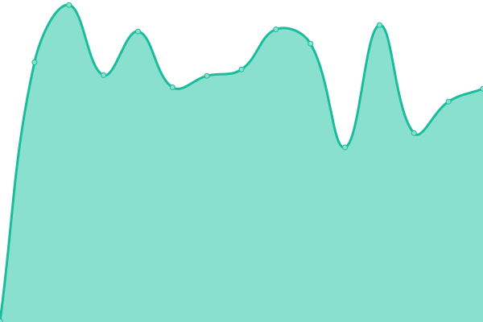 398ms
     
 | 

<a href="https://status.codeforafrica.org/history/civic-signal-topics">100.00%</a>
    

|  [CivicTechFund Africa](https://civictechfund.africa/) | 🟩 Up | [civic-tech-fund-africa.yml](https://github.com/CodeForAfrica/upptime/commits/HEAD/history/civic-tech-fund-africa.yml) | 

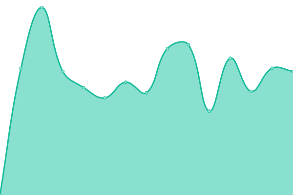 1156ms
     
 | 

<a href="https://status.codeforafrica.org/history/civic-tech-fund-africa">100.00%</a>
    

|  [Code for Africa](https://cfa.dev.codeforafrica.org) | 🟩 Up | [code-for-africa.yml](https://github.com/CodeForAfrica/upptime/commits/HEAD/history/code-for-africa.yml) | 

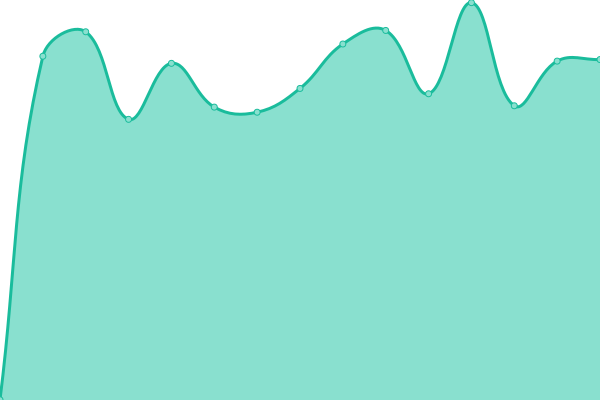 1814ms
     
 | 

<a href="https://status.codeforafrica.org/history/code-for-africa">99.41%</a>
    

|  [Code for Africa - Chat](https://chat.codeforafrica.org) | 🟩 Up | [code-for-africa-chat.yml](https://github.com/CodeForAfrica/upptime/commits/HEAD/history/code-for-africa-chat.yml) | 

 443ms
     
 | 

<a href="https://status.codeforafrica.org/history/code-for-africa-chat">100.00%</a>
    

|  [Code for Africa - Dub](https://cfa.fyi) | 🟩 Up | [code-for-africa-dub.yml](https://github.com/CodeForAfrica/upptime/commits/HEAD/history/code-for-africa-dub.yml) | 

 1602ms
     
 | 

<a href="https://status.codeforafrica.org/history/code-for-africa-dub">100.00%</a>
    

|  [commons.AFRICA](https://commons.africa) | 🟩 Up | [commons-africa.yml](https://github.com/CodeForAfrica/upptime/commits/HEAD/history/commons-africa.yml) | 

 239ms
     
 | 

<a href="https://status.codeforafrica.org/history/commons-africa">100.00%</a>
    

|  [connectedAFRICA](https://data.connectedafrica.net) | 🟩 Up | [connected-africa.yml](https://github.com/CodeForAfrica/upptime/commits/HEAD/history/connected-africa.yml) | 

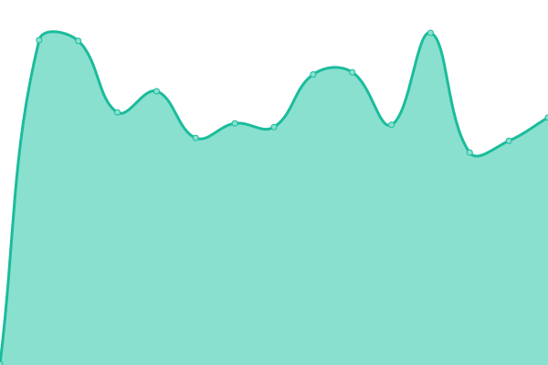 405ms
     
 | 

<a href="https://status.codeforafrica.org/history/connected-africa">100.00%</a>
    

|  [charterAFRICA](https://charter.africa) | 🟩 Up | [charter-africa.yml](https://github.com/CodeForAfrica/upptime/commits/HEAD/history/charter-africa.yml) | 

 863ms
     
 | 

<a href="https://status.codeforafrica.org/history/charter-africa">100.00%</a>
    

|  [charterAFRICA - Media](https://charter.africa/media/charter-logo.svg) | 🟩 Up | [charter-africa-media.yml](https://github.com/CodeForAfrica/upptime/commits/HEAD/history/charter-africa-media.yml) | 

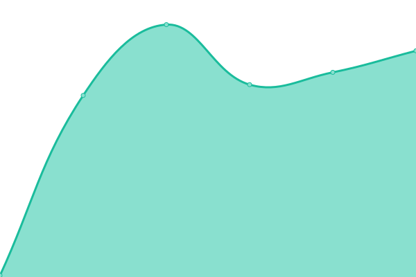 152ms
     
 | 

<a href="https://status.codeforafrica.org/history/charter-africa-media">100.00%</a>
    

|  [DebunkBot](https://debunkbot.dev.pesacheck.org) | 🟩 Up | [debunk-bot.yml](https://github.com/CodeForAfrica/upptime/commits/HEAD/history/debunk-bot.yml) | 

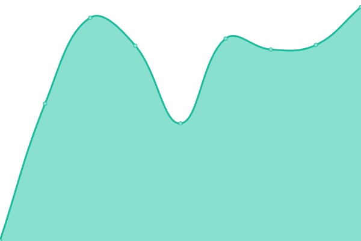 809ms
     
 | 

<a href="https://status.codeforafrica.org/history/debunk-bot">100.00%</a>
    

|  [Dominion](https://dominion.africa) | 🟩 Up | [dominion.yml](https://github.com/CodeForAfrica/upptime/commits/HEAD/history/dominion.yml) | 

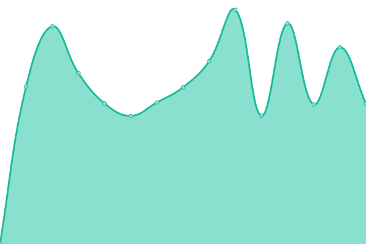 681ms
     
 | 

<a href="https://status.codeforafrica.org/history/dominion">99.67%</a>
    

|  [FeedShield](https://feedshield.africa) | 🟩 Up | [feed-shield.yml](https://github.com/CodeForAfrica/upptime/commits/HEAD/history/feed-shield.yml) | 

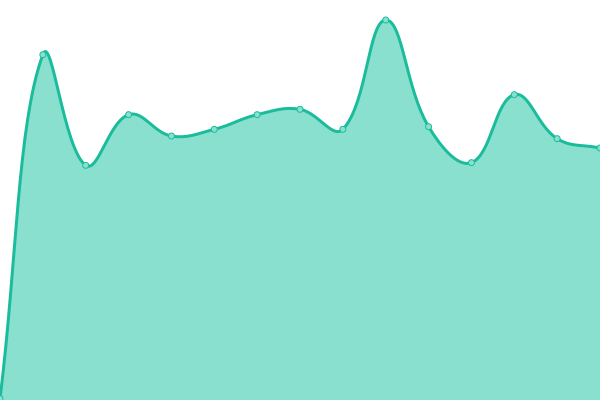 198ms
     
 | 

<a href="https://status.codeforafrica.org/history/feed-shield">100.00%</a>
    

|  [GenderGap.AFRICA](https://gendergap.africa/) | 🟩 Up | [gender-gap-africa.yml](https://github.com/CodeForAfrica/upptime/commits/HEAD/history/gender-gap-africa.yml) | 

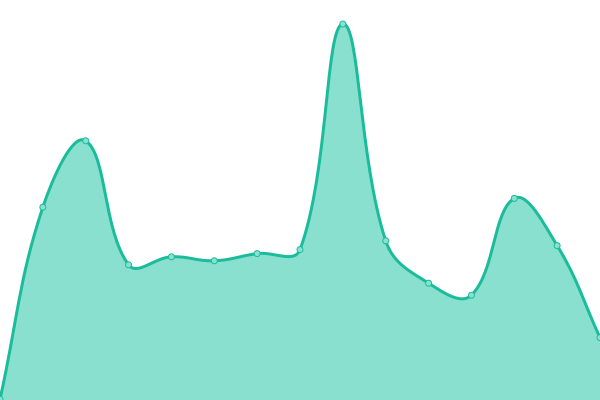 202ms
     
 | 

<a href="https://status.codeforafrica.org/history/gender-gap-africa">100.00%</a>
    

|  [HURUGraphQL](https://graphql.hurumap.org/graphiql) | 🟩 Up | [huru-graph-ql.yml](https://github.com/CodeForAfrica/upptime/commits/HEAD/history/huru-graph-ql.yml) | 

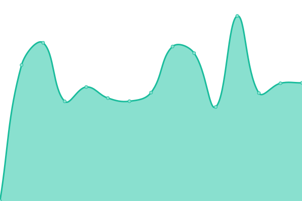 1048ms
     
 | 

<a href="https://status.codeforafrica.org/history/huru-graph-ql">100.00%</a>
    

|  [HURUmap](https://hurumap.org) | 🟩 Up | [hur-umap.yml](https://github.com/CodeForAfrica/upptime/commits/HEAD/history/hur-umap.yml) | 

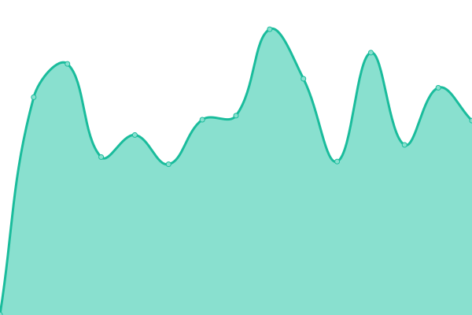 591ms
     
 | 

<a href="https://status.codeforafrica.org/history/hur-umap">100.00%</a>
    

|  [HURUmap - Kenya](https://kenya.hurumap.org) | 🟩 Up | [hur-umap-kenya.yml](https://github.com/CodeForAfrica/upptime/commits/HEAD/history/hur-umap-kenya.yml) | 

 583ms
     
 | 

<a href="https://status.codeforafrica.org/history/hur-umap-kenya">100.00%</a>
    

|  [HURUmap - Tanzania](https://tanzania.hurumap.org) | 🟩 Up | [hur-umap-tanzania.yml](https://github.com/CodeForAfrica/upptime/commits/HEAD/history/hur-umap-tanzania.yml) | 

 503ms
     
 | 

<a href="https://status.codeforafrica.org/history/hur-umap-tanzania">100.00%</a>
    

|  [HURUmap - Nigeria](https://nigeria.hurumap.org) | 🟩 Up | [hur-umap-nigeria.yml](https://github.com/CodeForAfrica/upptime/commits/HEAD/history/hur-umap-nigeria.yml) | 

 509ms
     
 | 

<a href="https://status.codeforafrica.org/history/hur-umap-nigeria">100.00%</a>
    

|  [HURUmap - Uganda](https://uganda.hurumap.org) | 🟩 Up | [hur-umap-uganda.yml](https://github.com/CodeForAfrica/upptime/commits/HEAD/history/hur-umap-uganda.yml) | 

 508ms
     
 | 

<a href="https://status.codeforafrica.org/history/hur-umap-uganda">100.00%</a>
    

|  [HURUmap - Zambia](https://zambia.hurumap.org) | 🟩 Up | [hur-umap-zambia.yml](https://github.com/CodeForAfrica/upptime/commits/HEAD/history/hur-umap-zambia.yml) | 

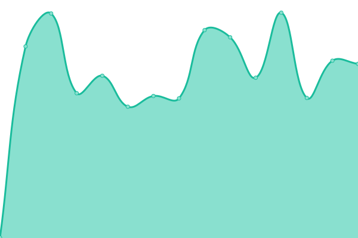 537ms
     
 | 

<a href="https://status.codeforafrica.org/history/hur-umap-zambia">100.00%</a>
    

|  [HURUmap - Zimbabwe](https://zimbabwe.hurumap.org) | 🟩 Up | [hur-umap-zimbabwe.yml](https://github.com/CodeForAfrica/upptime/commits/HEAD/history/hur-umap-zimbabwe.yml) | 

 541ms
     
 | 

<a href="https://status.codeforafrica.org/history/hur-umap-zimbabwe">100.00%</a>
    

|  [HURUmap NG](https://ng.hurumap.org) | 🟩 Up | [hur-umap-ng.yml](https://github.com/CodeForAfrica/upptime/commits/HEAD/history/hur-umap-ng.yml) | 

 496ms
     
 | 

<a href="https://status.codeforafrica.org/history/hur-umap-ng">100.00%</a>
    

|  [innovateAFRICA](https://innovateafrica.fund/) | 🟩 Up | [innovate-africa.yml](https://github.com/CodeForAfrica/upptime/commits/HEAD/history/innovate-africa.yml) | 

 2751ms
     
 | 

<a href="https://status.codeforafrica.org/history/innovate-africa">99.69%</a>
    

|  [investigate.AFRICA](https://investigate.africa/) | 🟩 Up | [investigate-africa.yml](https://github.com/CodeForAfrica/upptime/commits/HEAD/history/investigate-africa.yml) | 

 691ms
     
 | 

<a href="https://status.codeforafrica.org/history/investigate-africa">100.00%</a>
    

|  [Living Wage - Kenya](https://livingwage.pd.co.ke/) | 🟩 Up | [living-wage-kenya.yml](https://github.com/CodeForAfrica/upptime/commits/HEAD/history/living-wage-kenya.yml) | 

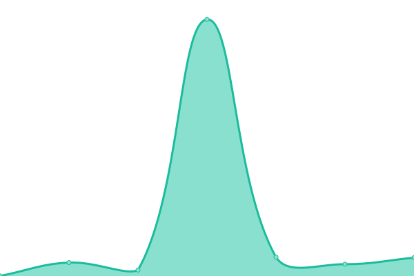 331ms
     
 | 

<a href="https://status.codeforafrica.org/history/living-wage-kenya">100.00%</a>
    

|  [MapIt](https://mapit.hurumap.org) | 🟩 Up | [map-it.yml](https://github.com/CodeForAfrica/upptime/commits/HEAD/history/map-it.yml) | 

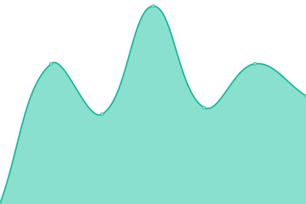 476ms
     
 | 

<a href="https://status.codeforafrica.org/history/map-it">100.00%</a>
    

|  [MaternalFigures](https://maternalfigures.com/) | 🟩 Up | [maternal-figures.yml](https://github.com/CodeForAfrica/upptime/commits/HEAD/history/maternal-figures.yml) | 

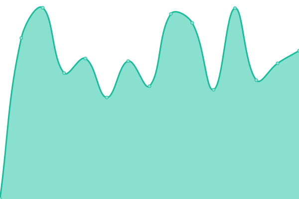 845ms
     
 | 

<a href="https://status.codeforafrica.org/history/maternal-figures">100.00%</a>
    

|  [openAFRICA](https://open.africa) | 🟩 Up | [open-africa.yml](https://github.com/CodeForAfrica/upptime/commits/HEAD/history/open-africa.yml) | 

 482ms
     
 | 

<a href="https://status.codeforafrica.org/history/open-africa">99.65%</a>
    

|  [openAFRICA API](https://bulk.openafrica.net/api) | 🟩 Up | [open-africa-api.yml](https://github.com/CodeForAfrica/upptime/commits/HEAD/history/open-africa-api.yml) | 

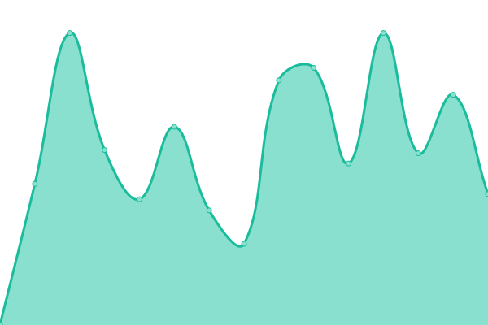 470ms
     
 | 

<a href="https://status.codeforafrica.org/history/open-africa-api">100.00%</a>
    

|  [OpenCTI](https://opencti.investigate.africa) | 🟩 Up | [open-cti.yml](https://github.com/CodeForAfrica/upptime/commits/HEAD/history/open-cti.yml) | 

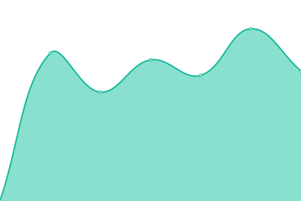 421ms
     
 | 

<a href="https://status.codeforafrica.org/history/open-cti">100.00%</a>
    

|  [outbreak.AFRICA](https://covid19.outbreak.africa) | 🟩 Up | [outbreak-africa.yml](https://github.com/CodeForAfrica/upptime/commits/HEAD/history/outbreak-africa.yml) | 

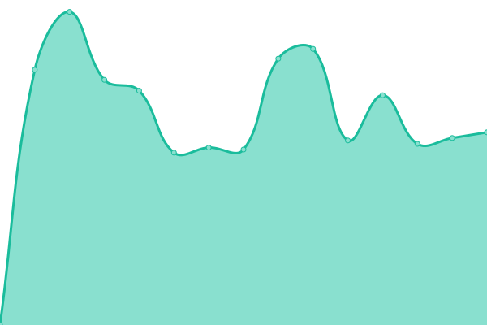 1671ms
     
 | 

<a href="https://status.codeforafrica.org/history/outbreak-africa">99.71%</a>
    

|  [PesaCheck](https://pesacheck.org) | 🟩 Up | [pesa-check.yml](https://github.com/CodeForAfrica/upptime/commits/HEAD/history/pesa-check.yml) | 

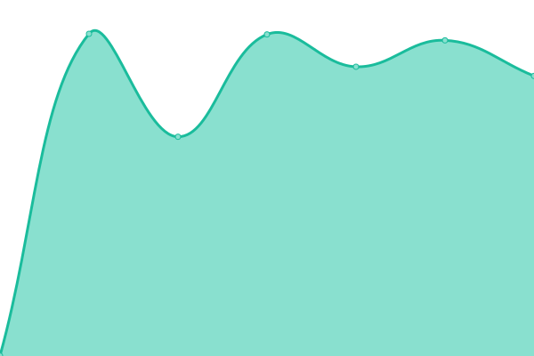 3678ms
     
 | 

<a href="https://status.codeforafrica.org/history/pesa-check">94.38%</a>
    

|  [PesaYetu](https://pesayetu.pesacheck.org/explore/ke) | 🟩 Up | [pesa-yetu.yml](https://github.com/CodeForAfrica/upptime/commits/HEAD/history/pesa-yetu.yml) | 

 1383ms
     
 | 

<a href="https://status.codeforafrica.org/history/pesa-yetu">97.32%</a>
    

|  [PFCA](https://dev.pfca.africa/) | 🟩 Up | [pfca.yml](https://github.com/CodeForAfrica/upptime/commits/HEAD/history/pfca.yml) | 

 793ms
     
 | 

<a href="https://status.codeforafrica.org/history/pfca">99.72%</a>
    

|  [Politwoops](https://politwoops.codeforkenya.org) | 🟥 Down | [politwoops.yml](https://github.com/CodeForAfrica/upptime/commits/HEAD/history/politwoops.yml) | 

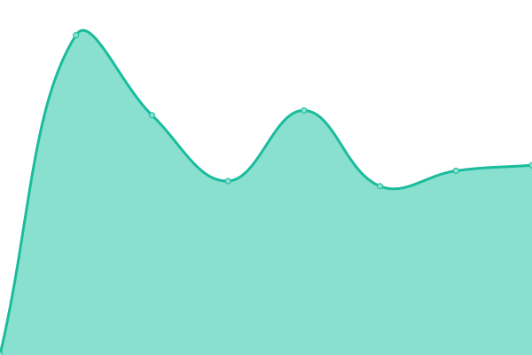 590ms
     
 | 

<a href="https://status.codeforafrica.org/history/politwoops">0.00%</a>
    

|  [PromiseTracker](https://promisetracker.dev.codeforafrica.org/) | 🟩 Up | [promise-tracker.yml](https://github.com/CodeForAfrica/upptime/commits/HEAD/history/promise-tracker.yml) | 

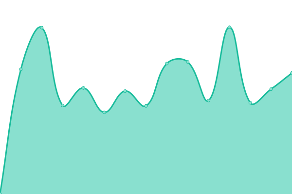 1083ms
     
 | 

<a href="https://status.codeforafrica.org/history/promise-tracker">99.42%</a>
    

|  [RoboShield](https://roboshield.trustlab.africa/) | 🟩 Up | [robo-shield.yml](https://github.com/CodeForAfrica/upptime/commits/HEAD/history/robo-shield.yml) | 

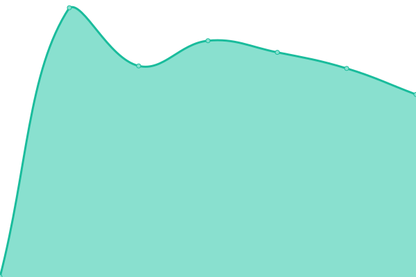 1637ms
     
 | 

<a href="https://status.codeforafrica.org/history/robo-shield">99.42%</a>
    

|  [sensors.AFRICA](https://sensors.africa) | 🟩 Up | [sensors-africa.yml](https://github.com/CodeForAfrica/upptime/commits/HEAD/history/sensors-africa.yml) | 

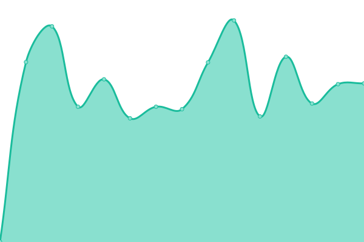 945ms
     
 | 

<a href="https://status.codeforafrica.org/history/sensors-africa">99.42%</a>
    

|  [sensors.AFRICA - Docs](https://api.sensors.africa/docs) | 🟩 Up | [sensors-africa-docs.yml](https://github.com/CodeForAfrica/upptime/commits/HEAD/history/sensors-africa-docs.yml) | 

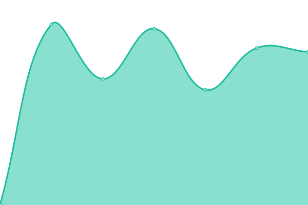 1123ms
     
 | 

<a href="https://status.codeforafrica.org/history/sensors-africa-docs">90.52%</a>
    

|  [sensors.AFRICA - Map (v2)](https://v2.map.aq.sensors.africa/#4/-4.46/19.54) | 🟩 Up | [sensors-africa-map-v2.yml](https://github.com/CodeForAfrica/upptime/commits/HEAD/history/sensors-africa-map-v2.yml) | 

 250ms
     
 | 

<a href="https://status.codeforafrica.org/history/sensors-africa-map-v2">100.00%</a>
    

|  [seaSensors.AFRICA (Coming Soon)](https://seasensors.africa/) | 🟩 Up | [sea-sensors-africa-coming-soon.yml](https://github.com/CodeForAfrica/upptime/commits/HEAD/history/sea-sensors-africa-coming-soon.yml) | 

 201ms
     
 | 

<a href="https://status.codeforafrica.org/history/sea-sensors-africa-coming-soon">100.00%</a>
    

|  [seaSensors.AFRICA (Alpha)](https://alpha.seasensors.africa/) | 🟩 Up | [sea-sensors-africa-alpha.yml](https://github.com/CodeForAfrica/upptime/commits/HEAD/history/sea-sensors-africa-alpha.yml) | 

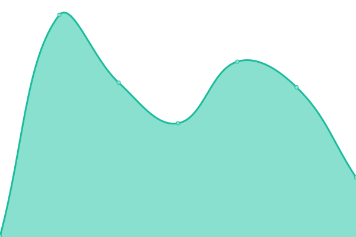 213ms
     
 | 

<a href="https://status.codeforafrica.org/history/sea-sensors-africa-alpha">100.00%</a>
    

|  [seaSensors.AFRICA - Map](https://map.seasensors.africa/) | 🟩 Up | [sea-sensors-africa-map.yml](https://github.com/CodeForAfrica/upptime/commits/HEAD/history/sea-sensors-africa-map.yml) | 

 221ms
     
 | 

<a href="https://status.codeforafrica.org/history/sea-sensors-africa-map">100.00%</a>
    

|  [sourceAFRICA](https://sourceafrica.net) | 🟥 Down | [source-africa.yml](https://github.com/CodeForAfrica/upptime/commits/HEAD/history/source-africa.yml) | 

 166ms
     
 | 

<a href="https://status.codeforafrica.org/history/source-africa">100.00%</a>
    

|  [stormWatch.sensors.AFRICA (Coming Soon)](https://stormwatch.sensors.africa/) | 🟩 Up | [storm-watch-sensors-africa-coming-soon.yml](https://github.com/CodeForAfrica/upptime/commits/HEAD/history/storm-watch-sensors-africa-coming-soon.yml) | 

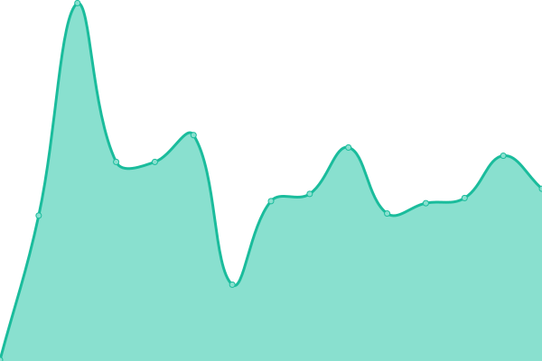 240ms
     
 | 

<a href="https://status.codeforafrica.org/history/storm-watch-sensors-africa-coming-soon">100.00%</a>
    

|  [TaxClock - Kenya](https://taxclock.pesacheck.org) | 🟩 Up | [tax-clock-kenya.yml](https://github.com/CodeForAfrica/upptime/commits/HEAD/history/tax-clock-kenya.yml) | 

 266ms
     
 | 

<a href="https://status.codeforafrica.org/history/tax-clock-kenya">100.00%</a>
    

|  [trafficked.AFRICA](https://trafficked.africa) | 🟩 Up | [trafficked-africa.yml](https://github.com/CodeForAfrica/upptime/commits/HEAD/history/trafficked-africa.yml) | 

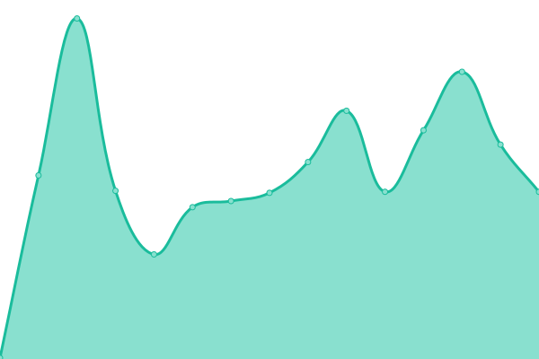 245ms
     
 | 

<a href="https://status.codeforafrica.org/history/trafficked-africa">100.00%</a>
    

|  [Troll Tracker](https://trolltracker.investigate.africa/) | 🟩 Up | [troll-tracker.yml](https://github.com/CodeForAfrica/upptime/commits/HEAD/history/troll-tracker.yml) | 

 797ms
     
 | 

<a href="https://status.codeforafrica.org/history/troll-tracker">100.00%</a>
    

|  [TrustLab](https://trustlab.africa) | 🟩 Up | [trust-lab.yml](https://github.com/CodeForAfrica/upptime/commits/HEAD/history/trust-lab.yml) | 

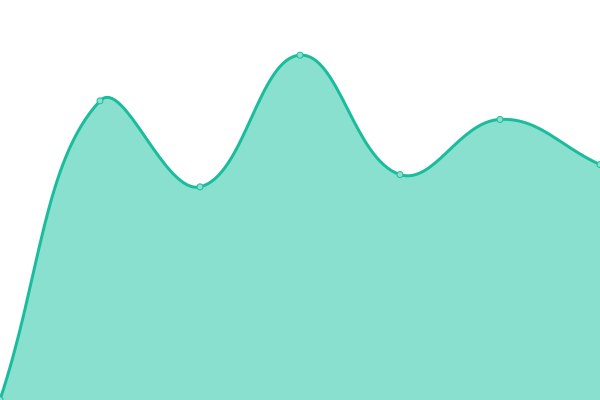 1345ms
     
 | 

<a href="https://status.codeforafrica.org/history/trust-lab">99.42%</a>
    

<!--end: status pages-->

[**Visit our status website →**](https://status.codeforafrica.org)

## 📄 License

- Powered by: [Upptime](https://github.com/upptime/upptime)
- Code: [MIT](./LICENSE) © [Code for Africa (CfA)](https://codeforafrica.org)
- Data in the `./history` directory: [Open Database License](https://opendatacommons.org/licenses/odbl/1-0/)
