# [📈 Live Status](https://status.codeforafrica.org): <!--live status--> **🟧 Partial outage**

This repository contains the open-source uptime monitor and status page for [Code for Africa (CfA)](https://codeforafrica.org), powered by [Upptime](https://github.com/upptime/upptime).

With [Upptime](https://upptime.js.org), you can get your own unlimited and free uptime monitor and status page, powered entirely by a GitHub repository. We use [Issues](https://github.com/CodeForAfrica/upptime/issues) as incident reports, [Actions](https://github.com/CodeForAfrica/upptime/actions) as uptime monitors, and [Pages](https://status.codeforafrica.org) for the status page.

<!--start: status pages-->
<!-- This summary is generated by Upptime (https://github.com/upptime/upptime) -->
<!-- Do not edit this manually, your changes will be overwritten -->
<!-- prettier-ignore -->
| URL | Status | History | Response Time | Uptime |
| --- | ------ | ------- | ------------- | ------ |
|  [academy.AFRICA](https://academy.africa/) | 🟩 Up | [academy-africa.yml](https://github.com/CodeForAfrica/upptime/commits/HEAD/history/academy-africa.yml) | 

 489ms
     
 | 

<a href="https://status.codeforafrica.org/history/academy-africa">100.00%</a>
    

|  [commons.AFRICA](https://commons.africa/) | 🟩 Up | [commons-africa.yml](https://github.com/CodeForAfrica/upptime/commits/HEAD/history/commons-africa.yml) | 

 175ms
     
 | 

<a href="https://status.codeforafrica.org/history/commons-africa">100.00%</a>
    

|  [AlertME - Kenya](https://greenalert.codeforkenya.org) | 🟩 Up | [alert-me-kenya.yml](https://github.com/CodeForAfrica/upptime/commits/HEAD/history/alert-me-kenya.yml) | 

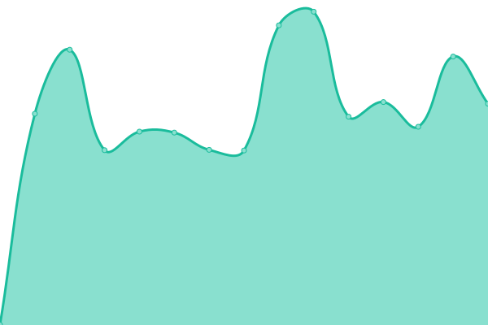 778ms
     
 | 

<a href="https://status.codeforafrica.org/history/alert-me-kenya">100.00%</a>
    

|  [AlertME - Nigeria](https://yamayama.codefornigeria.org) | 🟩 Up | [alert-me-nigeria.yml](https://github.com/CodeForAfrica/upptime/commits/HEAD/history/alert-me-nigeria.yml) | 

 667ms
     
 | 

<a href="https://status.codeforafrica.org/history/alert-me-nigeria">100.00%</a>
    

|  [AlertME - South Africa](https://greenalert.oxpeckers.org) | 🟩 Up | [alert-me-south-africa.yml](https://github.com/CodeForAfrica/upptime/commits/HEAD/history/alert-me-south-africa.yml) | 

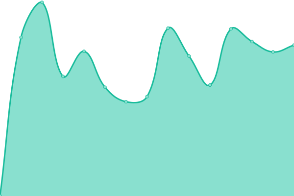 845ms
     
 | 

<a href="https://status.codeforafrica.org/history/alert-me-south-africa">100.00%</a>
    

|  [Code for Africa](https://cfa.dev.codeforafrica.org) | 🟩 Up | [code-for-africa.yml](https://github.com/CodeForAfrica/upptime/commits/HEAD/history/code-for-africa.yml) | 

 1239ms
     
 | 

<a href="https://status.codeforafrica.org/history/code-for-africa">100.00%</a>
    

|  [civicSIGNAL](https://civicsignal.africa) | 🟩 Up | [civic-signal.yml](https://github.com/CodeForAfrica/upptime/commits/HEAD/history/civic-signal.yml) | 

 328ms
     
 | 

<a href="https://status.codeforafrica.org/history/civic-signal">100.00%</a>
    

|  [civicSIGNAL - Explorer](https://explorer.civicsignal.africa) | 🟩 Up | [civic-signal-explorer.yml](https://github.com/CodeForAfrica/upptime/commits/HEAD/history/civic-signal-explorer.yml) | 

 330ms
     
 | 

<a href="https://status.codeforafrica.org/history/civic-signal-explorer">100.00%</a>
    

|  [civicSIGNAL - Sources](https://sources.civicsignal.africa) | 🟩 Up | [civic-signal-sources.yml](https://github.com/CodeForAfrica/upptime/commits/HEAD/history/civic-signal-sources.yml) | 

 324ms
     
 | 

<a href="https://status.codeforafrica.org/history/civic-signal-sources">100.00%</a>
    

|  [civicSIGNAL - Topics](https://topics.civicsignal.africa) | 🟩 Up | [civic-signal-topics.yml](https://github.com/CodeForAfrica/upptime/commits/HEAD/history/civic-signal-topics.yml) | 

 320ms
     
 | 

<a href="https://status.codeforafrica.org/history/civic-signal-topics">100.00%</a>
    

|  [Civic Tech Fund Africa](https://civictechfund.africa/) | 🟩 Up | [civic-tech-fund-africa.yml](https://github.com/CodeForAfrica/upptime/commits/HEAD/history/civic-tech-fund-africa.yml) | 

 1136ms
     
 | 

<a href="https://status.codeforafrica.org/history/civic-tech-fund-africa">100.00%</a>
    

|  [connectedAFRICA](https://data.connectedafrica.net) | 🟩 Up | [connected-africa.yml](https://github.com/CodeForAfrica/upptime/commits/HEAD/history/connected-africa.yml) | 

 374ms
     
 | 

<a href="https://status.codeforafrica.org/history/connected-africa">100.00%</a>
    

|  [charterAFRICA](https://charter.africa) | 🟩 Up | [charter-africa.yml](https://github.com/CodeForAfrica/upptime/commits/HEAD/history/charter-africa.yml) | 

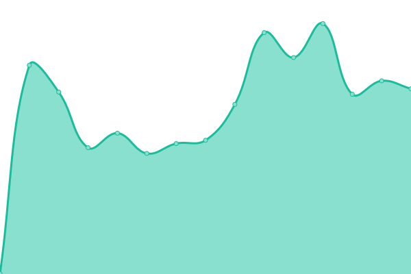 682ms
     
 | 

<a href="https://status.codeforafrica.org/history/charter-africa">100.00%</a>
    

|  [charterAFRICA - Media](https://charterafrica.prod.codeforafrica.org/media/charter-logo.svg) | 🟩 Up | [charter-africa-media.yml](https://github.com/CodeForAfrica/upptime/commits/HEAD/history/charter-africa-media.yml) | 

 529ms
     
 | 

<a href="https://status.codeforafrica.org/history/charter-africa-media">100.00%</a>
    

|  [DebunkBot](https://debunkbot.dev.pesacheck.org) | 🟩 Up | [debunk-bot.yml](https://github.com/CodeForAfrica/upptime/commits/HEAD/history/debunk-bot.yml) | 

 624ms
     
 | 

<a href="https://status.codeforafrica.org/history/debunk-bot">100.00%</a>
    

|  [DOMINION](https://dominion.africa) | 🟩 Up | [dominion.yml](https://github.com/CodeForAfrica/upptime/commits/HEAD/history/dominion.yml) | 

 550ms
     
 | 

<a href="https://status.codeforafrica.org/history/dominion">100.00%</a>
    

|  [FeedShield](https://feedshield.africa) | 🟩 Up | [feed-shield.yml](https://github.com/CodeForAfrica/upptime/commits/HEAD/history/feed-shield.yml) | 

 164ms
     
 | 

<a href="https://status.codeforafrica.org/history/feed-shield">100.00%</a>
    

|  [GenderGap.AFRICA](https://gendergap.africa/) | 🟩 Up | [gender-gap-africa.yml](https://github.com/CodeForAfrica/upptime/commits/HEAD/history/gender-gap-africa.yml) | 

 101ms
     
 | 

<a href="https://status.codeforafrica.org/history/gender-gap-africa">100.00%</a>
    

|  [HURUGraphQL](https://graphql.hurumap.org/graphiql) | 🟩 Up | [huru-graph-ql.yml](https://github.com/CodeForAfrica/upptime/commits/HEAD/history/huru-graph-ql.yml) | 

 908ms
     
 | 

<a href="https://status.codeforafrica.org/history/huru-graph-ql">100.00%</a>
    

|  [HURUmap](https://hurumap.org) | 🟩 Up | [hur-umap.yml](https://github.com/CodeForAfrica/upptime/commits/HEAD/history/hur-umap.yml) | 

 469ms
     
 | 

<a href="https://status.codeforafrica.org/history/hur-umap">100.00%</a>
    

|  [HURUmap NG](https://ng.hurumap.org) | 🟩 Up | [hur-umap-ng.yml](https://github.com/CodeForAfrica/upptime/commits/HEAD/history/hur-umap-ng.yml) | 

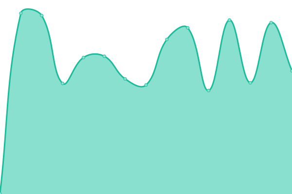 569ms
     
 | 

<a href="https://status.codeforafrica.org/history/hur-umap-ng">100.00%</a>
    

|  [HURUmap - Kenya](https://kenya.hurumap.org) | 🟩 Up | [hur-umap-kenya.yml](https://github.com/CodeForAfrica/upptime/commits/HEAD/history/hur-umap-kenya.yml) | 

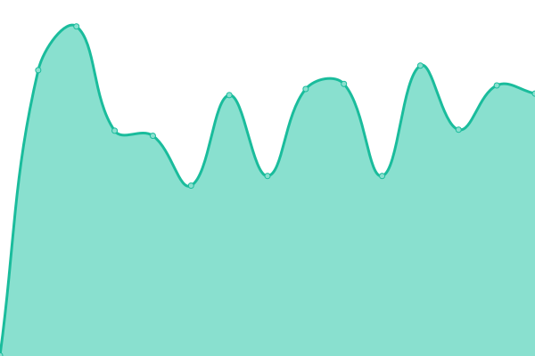 426ms
     
 | 

<a href="https://status.codeforafrica.org/history/hur-umap-kenya">100.00%</a>
    

|  [HURUmap - Tanzania](https://tanzania.hurumap.org) | 🟩 Up | [hur-umap-tanzania.yml](https://github.com/CodeForAfrica/upptime/commits/HEAD/history/hur-umap-tanzania.yml) | 

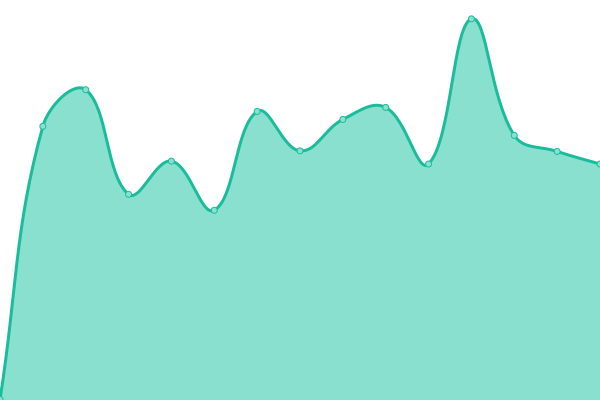 627ms
     
 | 

<a href="https://status.codeforafrica.org/history/hur-umap-tanzania">100.00%</a>
    

|  [HURUmap - Nigeria](https://nigeria.hurumap.org) | 🟩 Up | [hur-umap-nigeria.yml](https://github.com/CodeForAfrica/upptime/commits/HEAD/history/hur-umap-nigeria.yml) | 

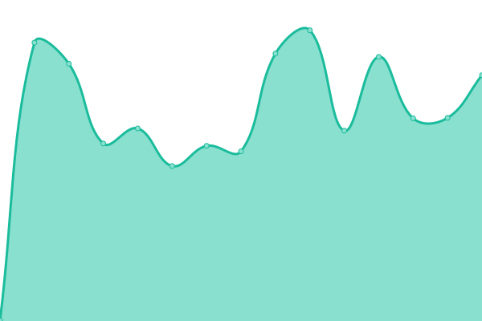 509ms
     
 | 

<a href="https://status.codeforafrica.org/history/hur-umap-nigeria">100.00%</a>
    

|  [HURUmap - Uganda](https://uganda.hurumap.org) | 🟩 Up | [hur-umap-uganda.yml](https://github.com/CodeForAfrica/upptime/commits/HEAD/history/hur-umap-uganda.yml) | 

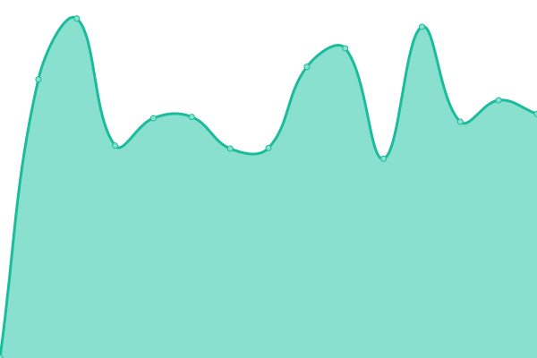 439ms
     
 | 

<a href="https://status.codeforafrica.org/history/hur-umap-uganda">100.00%</a>
    

|  [HURUmap - Zambia](https://zambia.hurumap.org) | 🟩 Up | [hur-umap-zambia.yml](https://github.com/CodeForAfrica/upptime/commits/HEAD/history/hur-umap-zambia.yml) | 

 472ms
     
 | 

<a href="https://status.codeforafrica.org/history/hur-umap-zambia">100.00%</a>
    

|  [HURUmap - Zimbabwe](https://zimbabwe.hurumap.org) | 🟩 Up | [hur-umap-zimbabwe.yml](https://github.com/CodeForAfrica/upptime/commits/HEAD/history/hur-umap-zimbabwe.yml) | 

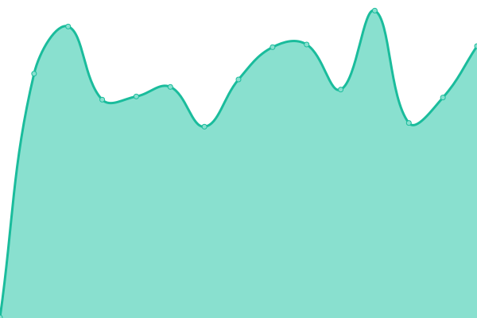 435ms
     
 | 

<a href="https://status.codeforafrica.org/history/hur-umap-zimbabwe">100.00%</a>
    

|  [innovateAFRICA](https://innovateafrica.fund/) | 🟩 Up | [innovate-africa.yml](https://github.com/CodeForAfrica/upptime/commits/HEAD/history/innovate-africa.yml) | 

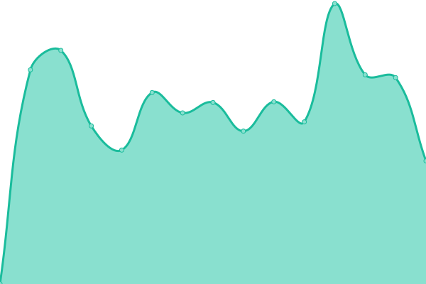 590ms
     
 | 

<a href="https://status.codeforafrica.org/history/innovate-africa">100.00%</a>
    

|  [investigate.AFRICA](https://investigate.africa/) | 🟩 Up | [investigate-africa.yml](https://github.com/CodeForAfrica/upptime/commits/HEAD/history/investigate-africa.yml) | 

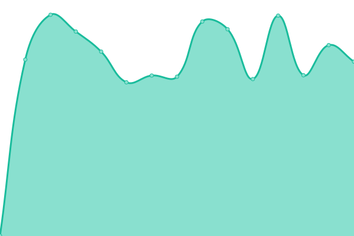 646ms
     
 | 

<a href="https://status.codeforafrica.org/history/investigate-africa">100.00%</a>
    

|  [LivingWage.KE](https://livingwage.pd.co.ke/) | 🟩 Up | [living-wage-ke.yml](https://github.com/CodeForAfrica/upptime/commits/HEAD/history/living-wage-ke.yml) | 

 400ms
     
 | 

<a href="https://status.codeforafrica.org/history/living-wage-ke">100.00%</a>
    

|  [MAPIT](https://mapit.hurumap.org) | 🟩 Up | [mapit.yml](https://github.com/CodeForAfrica/upptime/commits/HEAD/history/mapit.yml) | 

 440ms
     
 | 

<a href="https://status.codeforafrica.org/history/mapit">100.00%</a>
    

|  [MaternalFigures](https://maternalfigures.com/) | 🟩 Up | [maternal-figures.yml](https://github.com/CodeForAfrica/upptime/commits/HEAD/history/maternal-figures.yml) | 

 724ms
     
 | 

<a href="https://status.codeforafrica.org/history/maternal-figures">100.00%</a>
    

|  [openAFRICA](https://open.africa) | 🟩 Up | [open-africa.yml](https://github.com/CodeForAfrica/upptime/commits/HEAD/history/open-africa.yml) | 

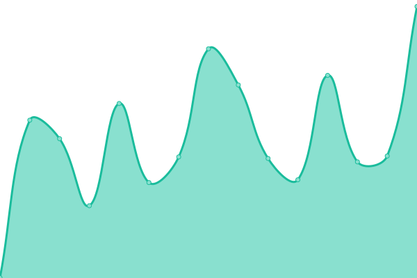 483ms
     
 | 

<a href="https://status.codeforafrica.org/history/open-africa">99.82%</a>
    

|  [openAFRICA API](https://bulk.openafrica.net/api) | 🟩 Up | [open-africa-api.yml](https://github.com/CodeForAfrica/upptime/commits/HEAD/history/open-africa-api.yml) | 

 466ms
     
 | 

<a href="https://status.codeforafrica.org/history/open-africa-api">98.85%</a>
    

|  [opencti.Investigate Africa](https://opencti.investigate.africa) | 🟩 Up | [opencti-investigate-africa.yml](https://github.com/CodeForAfrica/upptime/commits/HEAD/history/opencti-investigate-africa.yml) | 

 318ms
     
 | 

<a href="https://status.codeforafrica.org/history/opencti-investigate-africa">100.00%</a>
    

|  [outbreak.AFRICA](https://covid19.outbreak.africa) | 🟩 Up | [outbreak-africa.yml](https://github.com/CodeForAfrica/upptime/commits/HEAD/history/outbreak-africa.yml) | 

 1343ms
     
 | 

<a href="https://status.codeforafrica.org/history/outbreak-africa">100.00%</a>
    

|  [PesaYetu](https://pesayetu.pesacheck.org/explore/ke) | 🟩 Up | [pesa-yetu.yml](https://github.com/CodeForAfrica/upptime/commits/HEAD/history/pesa-yetu.yml) | 

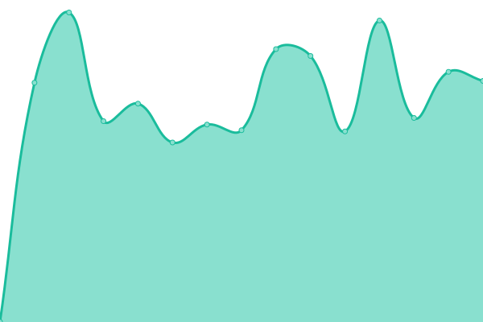 1271ms
     
 | 

<a href="https://status.codeforafrica.org/history/pesa-yetu">100.00%</a>
    

|  [PFCA](https://dev.pfca.africa/) | 🟩 Up | [pfca.yml](https://github.com/CodeForAfrica/upptime/commits/HEAD/history/pfca.yml) | 

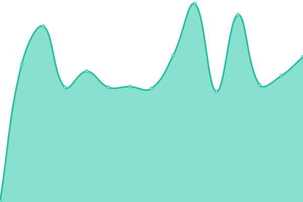 395ms
     
 | 

<a href="https://status.codeforafrica.org/history/pfca">100.00%</a>
    

|  [Politwoops](https://politwoops.codeforkenya.org) | 🟥 Down | [politwoops.yml](https://github.com/CodeForAfrica/upptime/commits/HEAD/history/politwoops.yml) | 

 635ms
     
 | 

<a href="https://status.codeforafrica.org/history/politwoops">0.00%</a>
    

|  [PromiseTracker](https://promisetracker.dev.codeforafrica.org/) | 🟩 Up | [promise-tracker.yml](https://github.com/CodeForAfrica/upptime/commits/HEAD/history/promise-tracker.yml) | 

 789ms
     
 | 

<a href="https://status.codeforafrica.org/history/promise-tracker">100.00%</a>
    

|  [sensors.AFRICA](https://sensors.africa) | 🟩 Up | [sensors-africa.yml](https://github.com/CodeForAfrica/upptime/commits/HEAD/history/sensors-africa.yml) | 

 533ms
     
 | 

<a href="https://status.codeforafrica.org/history/sensors-africa">100.00%</a>
    

|  [sensors.AFRICA - API](https://api.sensors.africa/docs) | 🟥 Down | [sensors-africa-api.yml](https://github.com/CodeForAfrica/upptime/commits/HEAD/history/sensors-africa-api.yml) | 

 3771ms
     
 | 

<a href="https://status.codeforafrica.org/history/sensors-africa-api">73.62%</a>
    

|  [sensors.AFRICA - v2Map](https://v2.map.aq.sensors.africa/#4/-4.46/19.54) | 🟩 Up | [sensors-africa-v2-map.yml](https://github.com/CodeForAfrica/upptime/commits/HEAD/history/sensors-africa-v2-map.yml) | 

 133ms
     
 | 

<a href="https://status.codeforafrica.org/history/sensors-africa-v2-map">100.00%</a>
    

|  [seaSensors.AFRICA (Coming Soon)](https://seasensors.africa/) | 🟩 Up | [sea-sensors-africa-coming-soon.yml](https://github.com/CodeForAfrica/upptime/commits/HEAD/history/sea-sensors-africa-coming-soon.yml) | 

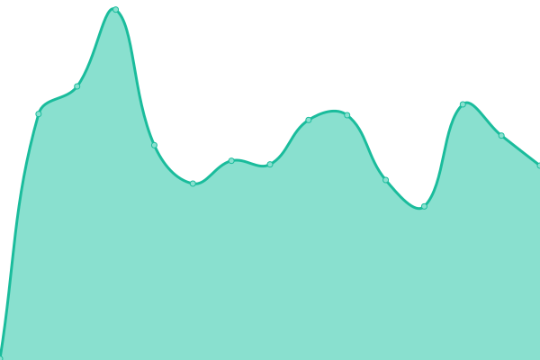 127ms
     
 | 

<a href="https://status.codeforafrica.org/history/sea-sensors-africa-coming-soon">100.00%</a>
    

|  [seaSensors.AFRICA](https://alpha.seasensors.africa/) | 🟩 Up | [sea-sensors-africa.yml](https://github.com/CodeForAfrica/upptime/commits/HEAD/history/sea-sensors-africa.yml) | 

 143ms
     
 | 

<a href="https://status.codeforafrica.org/history/sea-sensors-africa">100.00%</a>
    

|  [seaSensors.AFRICA - Map](https://map.seasensors.africa/) | 🟩 Up | [sea-sensors-africa-map.yml](https://github.com/CodeForAfrica/upptime/commits/HEAD/history/sea-sensors-africa-map.yml) | 

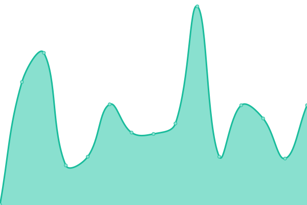 146ms
     
 | 

<a href="https://status.codeforafrica.org/history/sea-sensors-africa-map">100.00%</a>
    

|  [sourceAFRICA](https://sourceafrica.net) | 🟩 Up | [source-africa.yml](https://github.com/CodeForAfrica/upptime/commits/HEAD/history/source-africa.yml) | 

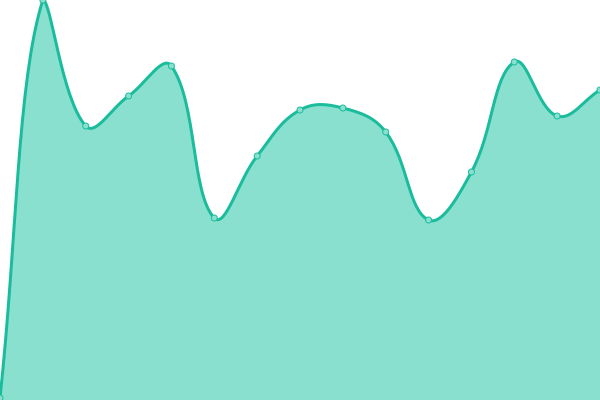 540ms
     
 | 

<a href="https://status.codeforafrica.org/history/source-africa">100.00%</a>
    

|  [stormWatch.sensors.AFRICA (Coming Soon)](https://stormwatch.sensors.africa/) | 🟩 Up | [storm-watch-sensors-africa-coming-soon.yml](https://github.com/CodeForAfrica/upptime/commits/HEAD/history/storm-watch-sensors-africa-coming-soon.yml) | 

 94ms
     
 | 

<a href="https://status.codeforafrica.org/history/storm-watch-sensors-africa-coming-soon">100.00%</a>
    

|  [TaxClock.Kenya](https://taxclock.pesacheck.org/) | 🟩 Up | [tax-clock-kenya.yml](https://github.com/CodeForAfrica/upptime/commits/HEAD/history/tax-clock-kenya.yml) | 

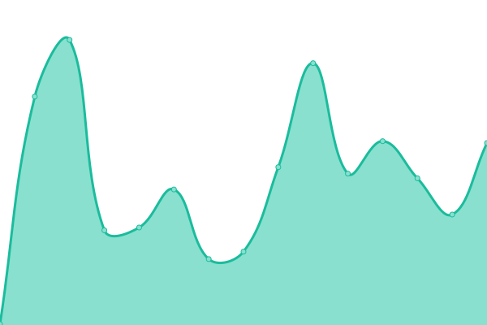 188ms
     
 | 

<a href="https://status.codeforafrica.org/history/tax-clock-kenya">100.00%</a>
    

|  [trafficked.AFRICA](https://trafficked.africa) | 🟩 Up | [trafficked-africa.yml](https://github.com/CodeForAfrica/upptime/commits/HEAD/history/trafficked-africa.yml) | 

 93ms
     
 | 

<a href="https://status.codeforafrica.org/history/trafficked-africa">100.00%</a>
    

|  [TrollTracker](https://trolltracker.investigate.africa/) | 🟩 Up | [troll-tracker.yml](https://github.com/CodeForAfrica/upptime/commits/HEAD/history/troll-tracker.yml) | 

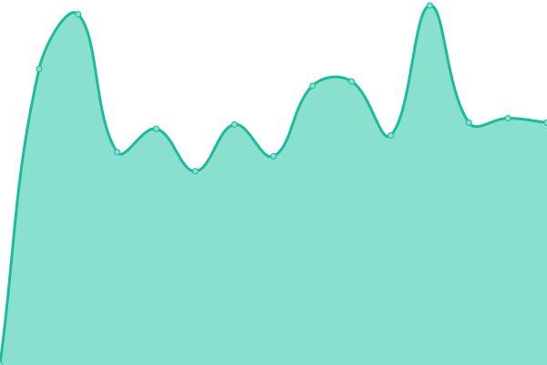 769ms
     
 | 

<a href="https://status.codeforafrica.org/history/troll-tracker">100.00%</a>
    

|  [TrollTracker API](https://dev.investigate.africa/health) | 🟥 Down | [troll-tracker-api.yml](https://github.com/CodeForAfrica/upptime/commits/HEAD/history/troll-tracker-api.yml) | 

 1166ms
     
 | 

<a href="https://status.codeforafrica.org/history/troll-tracker-api">75.65%</a>
    

|  [ActNow API](https://actnow.dev.codeforafrica.org/health) | 🟥 Down | [act-now-api.yml](https://github.com/CodeForAfrica/upptime/commits/HEAD/history/act-now-api.yml) | 

 692ms
     
 | 

<a href="https://status.codeforafrica.org/history/act-now-api">75.66%</a>
    

<!--end: status pages-->

[**Visit our status website →**](https://status.codeforafrica.org)

## 📄 License

- Powered by: [Upptime](https://github.com/upptime/upptime)
- Code: [MIT](./LICENSE) © [Code for Africa (CfA)](https://codeforafrica.org)
- Data in the `./history` directory: [Open Database License](https://opendatacommons.org/licenses/odbl/1-0/)
